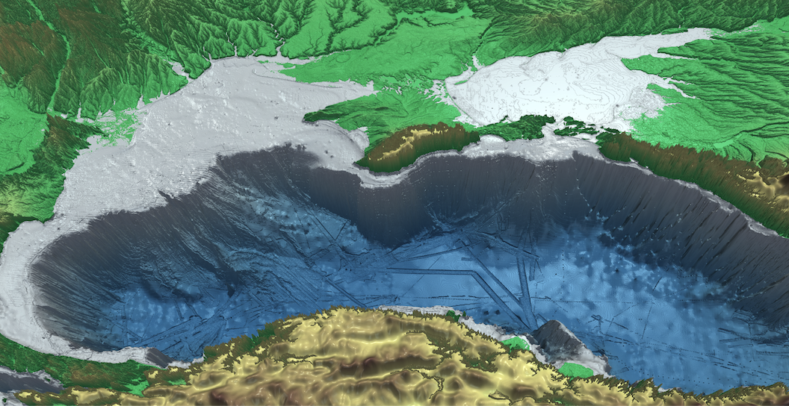

## Hey there, I'm Ali 👋

<em>Scientific Programmer at <a href='https://ims.metu.edu.tr/'>METU Institute of Marine Sciences</a>
 
 
 
 
 
 
 
 
  
 
- 🔭 Currently working on modeling efforts for three [Horizon EU](https://x.com/HorizonEU) projects: <a href='https://bridgeblacksea.org'>Bridge-BS</a>, <a href='https://www.doorsblacksea.eu/DOORS'>DOORS</a>, and <a href='https://arsinoe-project.eu/'>ARSINOE</a>  
   
 
- 🚀 Developing the NEMO-<a href='https://github.com/alioacar/TURSEM'>TURSEM</a> coupled physics-biogeochemistry climate model for BlackSea</em>

